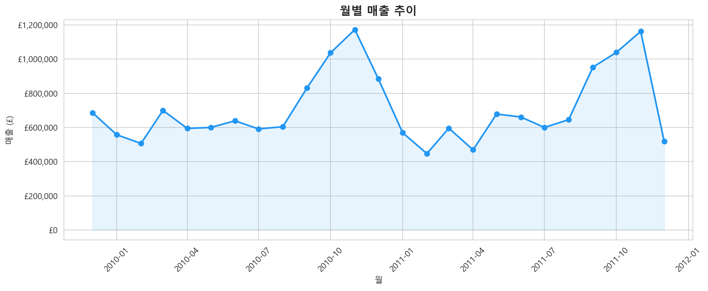
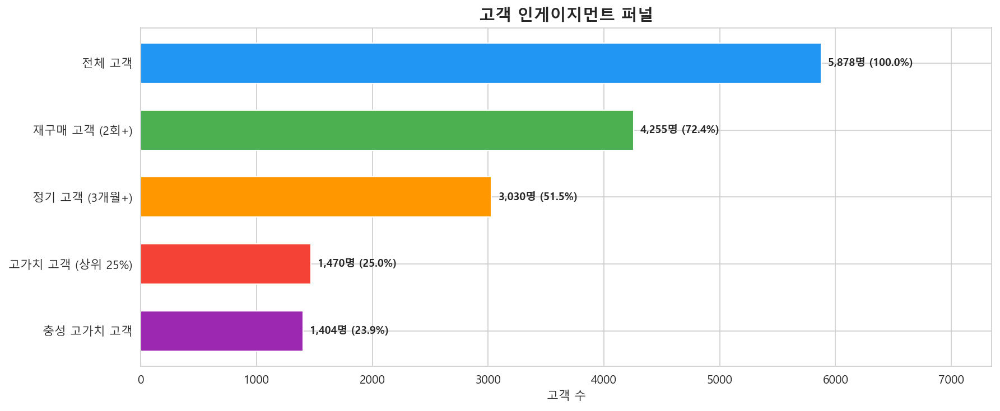
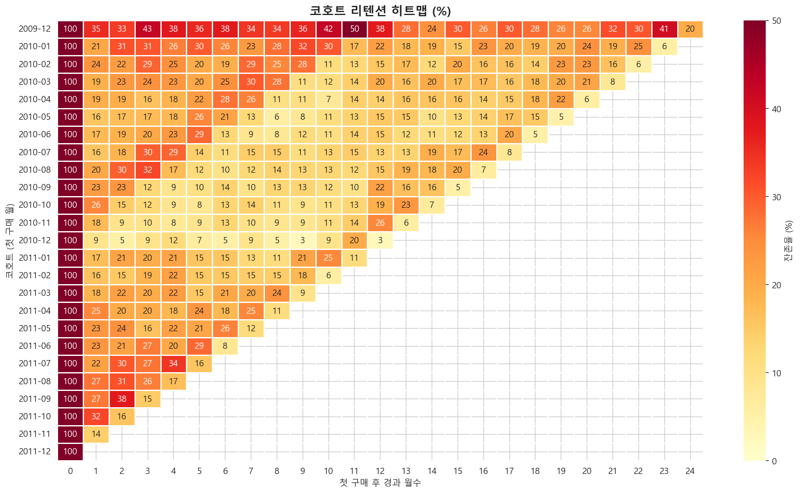
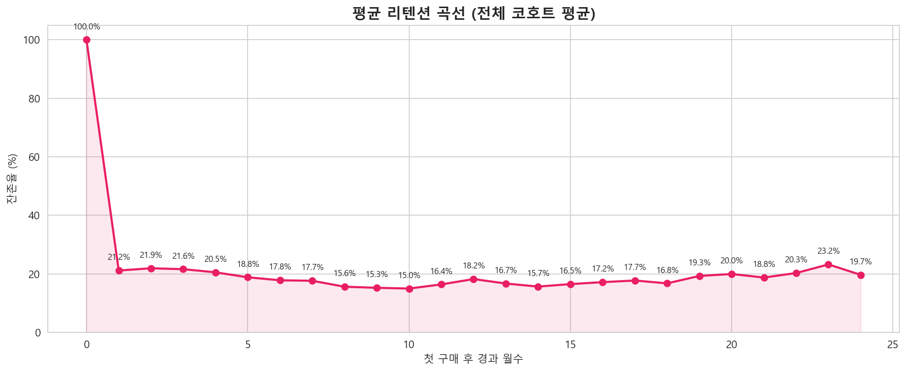
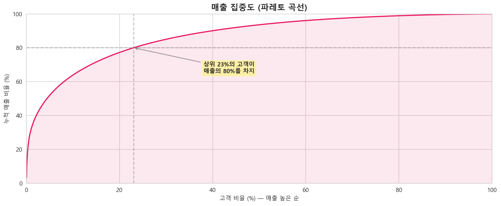
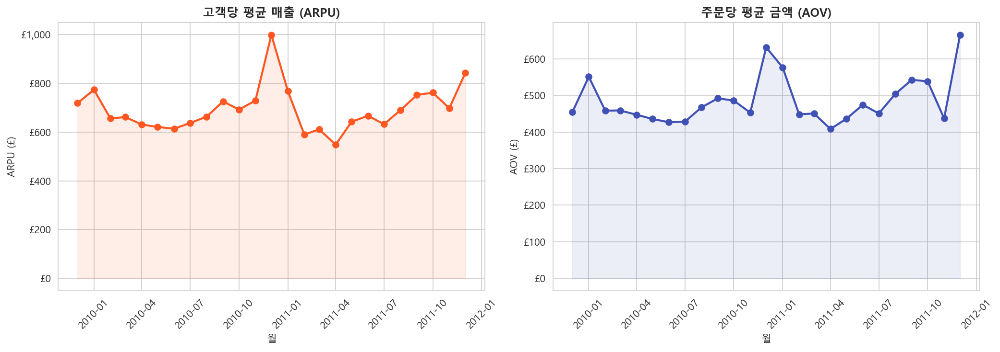
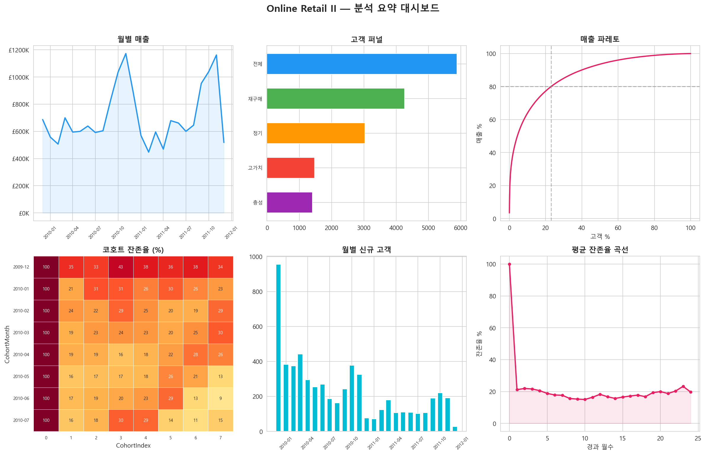

# Online Retail II — 퍼널, 코호트 & AARRR 분석

영국 온라인 리테일 실거래 데이터(~100만 건)를 활용한 고객 행동 분석 프로젝트입니다.

## 핵심 발견

| 발견 | 내용 |
|---|---|
| **매출 집중 리스크** | 상위 23%의 고객이 전체 매출(£17.7M)의 80%를 만든다 |
| **1회성 구매 문제** | 전체 고객의 27.6%가 딱 1번 사고 다시 오지 않는다 |
| **높은 재구매 기반** | 72.4%는 재구매 고객이지만, 첫 달 이탈이 가장 크다 |
| **영국 의존도** | 영국이 전체 매출의 83.0%를 차지한다 (5,878명 고객 중) |
| **계절 패턴** | Q4(9~11월) 연말 쇼핑 시즌에 매출이 급증한다 |

## 이 프로젝트에서 사용한 분석 기법

> 아래 3가지 분석은 데이터 분석/그로스해킹에서 가장 기본이 되는 프레임워크입니다.

### 퍼널(Funnel) 분석 — "어디서 고객이 빠지나?"
퍼널은 "깔때기"라는 뜻입니다. 고객이 처음 들어와서 충성 고객이 되기까지의 과정을 단계별로 나눠서, **각 단계에서 몇 명이 남고 몇 명이 이탈하는지** 보는 분석입니다. 어디서 가장 많이 빠지는지 알아야 그 구간에 마케팅 비용을 집중할 수 있습니다.

### 코호트(Cohort) 분석 — "시간이 지나면 고객이 남나?"
코호트는 "같은 시기에 처음 구매한 고객 그룹"입니다. 예를 들어 "2010년 3월에 처음 산 고객들"이 1개월 후, 3개월 후, 6개월 후에 각각 몇 %가 다시 오는지 추적합니다. **리텐션(잔존율)**이 높으면 건강한 비즈니스, 낮으면 새는 양동이에 물 붓는 격입니다.

### AARRR 분석 — "서비스 성장의 어디가 약한가?"
Acquisition(획득) → Activation(활성화) → Retention(유지) → Revenue(수익) → Referral(추천), 5단계로 서비스 성장을 진단하는 프레임워크입니다. 발음이 해적 소리 같아서 "해적 지표"라고도 부릅니다.

## 분석 결과

### 월별 매출 추이


### 고객 인게이지먼트 퍼널


### 코호트 리텐션 히트맵
> 가로축은 "첫 구매 후 경과 월수", 세로축은 "코호트(첫 구매 월)", 숫자는 잔존율(%)입니다.
> 색이 진할수록 많이 돌아온 것이고, 연할수록 이탈한 것입니다.



### 평균 리텐션 곡선


### 매출 집중도 (파레토 곡선)


### AARRR: 고객당 평균 매출(ARPU) & 주문당 평균 금액(AOV)


### 요약 대시보드


## 비즈니스 제안

1. **첫 달 이탈을 줄여라** — 첫 구매 후 7/14/30일에 맞춤형 상품 추천 이메일을 보내 재구매를 유도한다
2. **고가치 고객 충성 프로그램** — 매출 80%를 만드는 상위 23% 고객을 위한 등급별 리워드를 제공한다
3. **해외 시장 개척** — 비UK 상위 시장(네덜란드, 아일랜드, 독일, 프랑스)에 현지화 마케팅을 실시한다
4. **1월 재활성화 캠페인** — 연말 쇼핑 시즌 신규 고객이 1월에 이탈하지 않도록 타겟 캠페인을 실행한다

## 데이터셋

- **출처**: [Online Retail II (UCI)](https://archive.ics.uci.edu/dataset/502/online+retail+ii)
- **기간**: 2009년 12월 ~ 2011년 12월
- **원본 행 수**: ~1,067,000건 (정제 후 ~805,000건)
- **고유 고객 수**: 5,878명
- **주요 국가**: 영국 기반 온라인 리테일러

## 기술 스택

- Python 3.11
- pandas, NumPy — 데이터 처리
- Matplotlib, Seaborn — 시각화
- Jupyter Notebook — 인터랙티브 분석 환경
- openpyxl — Excel 파일 읽기

## 실행 방법

```bash
# 1. 레포지토리 클론
git clone https://github.com/<your-username>/user-funnel-cohort-analysis.git
cd user-funnel-cohort-analysis

# 2. 가상환경 생성
python -m venv .venv
source .venv/bin/activate  # Windows: .venv\Scripts\activate

# 3. 패키지 설치
pip install -r requirements.txt

# 4. 데이터 다운로드
# UCI 또는 Kaggle에서 "Online Retail II" 다운로드 후 data/ 폴더에 배치

# 5. 노트북 실행
jupyter notebook notebooks/analysis.ipynb
```

## 프로젝트 구조

```
user-funnel-cohort-analysis/
├── .gitignore
├── README.md
├── requirements.txt
├── data/                    # 데이터셋 (git에 포함 안 됨)
│   └── online_retail_II.xlsx
├── notebooks/
│   └── analysis.ipynb       # 전체 분석 노트북
└── images/                  # 차트 이미지 (README에서 참조)
    ├── 01_monthly_revenue.png
    ├── 02_monthly_customers.png
    ├── 03_top10_countries.png
    ├── 04_order_frequency.png
    ├── 05_pareto.png
    ├── 06_funnel.png
    ├── 07_cohort_heatmap.png
    ├── 08_cohort_size.png
    ├── 09_avg_retention.png
    ├── 10_acquisition.png
    ├── 11_arpu_aov.png
    └── 12_summary_dashboard.png
```
